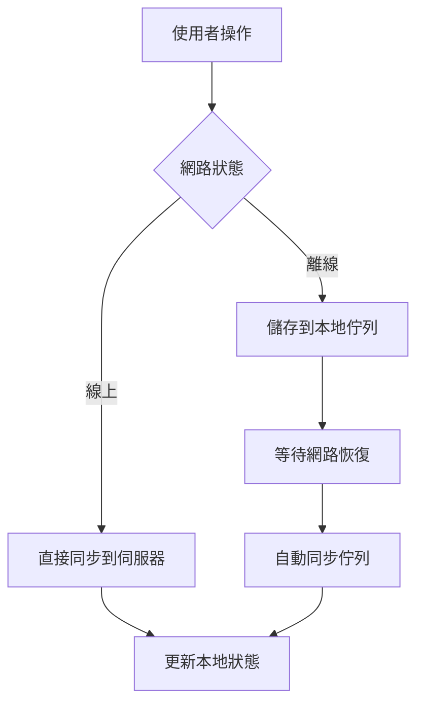

# 離線與同步功能說明

## 📋 概述

本專案現在支援完整的**離線模式**和**同步功能**，讓使用者無論在何種網路環境下都能順暢使用報名系統。

## 🔌 離線模式 (Offline Mode)

### 什麼是離線模式？
離線模式是指應用程式在沒有網路連線的情況下仍能正常運作的功能。

### 離線模式的特點：

#### ✅ **優點**
- **不依賴網路**：即使沒有網路連線也能使用
- **快速載入**：資料從本地儲存讀取，速度極快
- **節省流量**：減少網路資料使用
- **穩定可靠**：不受網路不穩定影響

#### ❌ **限制**
- **資料孤立**：只能存取本地儲存的資料
- **無法即時更新**：無法獲取最新的活動資訊
- **多裝置不同步**：不同裝置間的資料無法共享

### 離線模式下的功能：
1. **瀏覽已載入的活動**
2. **填寫報名表單**
3. **進行電子簽名**
4. **暫存表單資料**
5. **查看歷史報名記錄**

## 🔄 同步功能 (Sync)

### 什麼是同步？
同步是指將本地資料與遠端伺服器進行雙向資料交換的過程。

### 同步的類型：

#### 1. **自動同步**
- 網路恢復時自動同步
- 定期背景同步
- 即時資料更新

#### 2. **手動同步**
- 使用者主動觸發同步
- 強制重新整理資料
- 解決同步衝突

### 同步流程：



## 🛠️ 技術實作

### 1. 網路狀態檢測
```javascript
// 檢測網路連線狀態
this.isOnline = navigator.onLine;

// 監聽網路狀態變化
window.addEventListener('online', () => {
    this.isOnline = true;
    this.processSyncQueue(); // 處理待同步資料
});

window.addEventListener('offline', () => {
    this.isOnline = false;
    // 切換到離線模式
});
```

### 2. 離線資料佇列
```javascript
// 離線時將資料加入佇列
addToSyncQueue(data) {
    this.syncQueue.push({
        ...data,
        timestamp: Date.now(),
        retryCount: 0
    });
}
```

### 3. 自動同步機制
```javascript
// 網路恢復時自動處理佇列
async processSyncQueue() {
    while (this.syncQueue.length > 0) {
        const item = this.syncQueue[0];
        try {
            await this.syncToServer(item);
            this.syncQueue.shift(); // 成功後移除
        } catch (error) {
            // 重試機制
            item.retryCount++;
            if (item.retryCount >= 3) {
                this.syncQueue.shift(); // 移除失敗項目
            }
        }
    }
}
```

### 4. 衝突解決
```javascript
// 比較時間戳記解決資料衝突
resolveDataConflict(localData, serverData) {
    const localTime = new Date(localData.submittedAt).getTime();
    const serverTime = new Date(serverData.submittedAt).getTime();
    
    return localTime > serverTime ? localData : serverData;
}
```

## 📊 使用場景對比

| 場景 | 離線模式 | 同步模式 |
|------|----------|----------|
| **網路不穩定** | ✅ 完美運作 | ❌ 可能失敗 |
| **地鐵/電梯** | ✅ 持續可用 | ❌ 無法使用 |
| **即時更新** | ❌ 無法獲取 | ✅ 即時同步 |
| **多裝置使用** | ❌ 資料孤立 | ✅ 資料共享 |
| **資料安全** | ⚠️ 僅本地 | ✅ 伺服器備份 |

## 🎯 最佳實踐

### 對使用者：
1. **離線時**：正常填寫表單，系統會自動暫存
2. **網路恢復**：系統會自動同步，無需手動操作
3. **重要資料**：建議在網路良好時提交

### 對開發者：
1. **錯誤處理**：實作完整的錯誤處理和重試機制
2. **使用者提示**：清楚顯示網路狀態和同步狀態
3. **資料驗證**：同步前後都要驗證資料完整性
4. **效能優化**：避免頻繁同步影響使用者體驗

## 🔧 設定選項

### 同步間隔設定
```javascript
// 可調整的同步參數
const syncConfig = {
    retryAttempts: 3,        // 重試次數
    retryDelay: 5000,        // 重試延遲（毫秒）
    syncInterval: 30000,     // 自動同步間隔
    batchSize: 10            // 批次同步大小
};
```

### 網路狀態指示器
- 🟢 **已連線**：綠色指示器，資料即時同步
- 🔴 **離線模式**：紅色指示器，資料暫存本地

## 🚀 未來改進

1. **增量同步**：只同步變更的資料
2. **壓縮傳輸**：減少網路流量
3. **加密傳輸**：提升資料安全性
4. **離線快取**：預先載入常用資料
5. **智慧同步**：根據網路品質調整同步策略

## 📝 總結

離線和同步功能相輔相成，為使用者提供了：

- **無縫體驗**：無論網路狀況如何都能使用
- **資料安全**：本地暫存 + 伺服器備份
- **智慧同步**：自動處理網路狀態變化
- **衝突解決**：確保資料一致性

這樣的設計讓報名系統更加可靠和實用，特別適合在網路環境不穩定的情況下使用。

